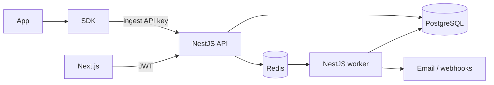

# PulseWatch

A lightweight, multi-tenant observability and alerting platform (Datadog/Sentry-style) for application logs, errors, request metrics, and threshold alerts.

This is a **backend-first** portfolio project: event-driven ingest, queues, tenancy, and reliability matter more than dashboard polish.

**Status:** Phase 1 — Foundation **complete**. Next: **Phase 2 Authentication and multi-tenancy** ([docs/development/phases.md](./docs/development/phases.md)).

## What it does

Teams register, create a workspace, register projects, mint hashed API keys, and send telemetry through a Node.js SDK or `POST /api/v1/ingest`. PulseWatch authenticates, validates, enqueues, and returns **202**. Workers persist events, roll up request stats, and evaluate alert rules on a schedule. The dashboard queries PostgreSQL for search, charts, and alert history. Notifications go out over email and webhooks.

## Architecture (snapshot)

```text
App → SDK → NestJS API → Redis (BullMQ) → NestJS worker → PostgreSQL
                ↑                               ↓
         Next.js dashboard              email / webhooks
```

Two processes, one modular monolith. Not a microservice mesh.



Details: [docs/architecture/overview.md](./docs/architecture/overview.md). Event flow: [data-flow](./docs/architecture/data-flow.md). Alerts: [alerting](./docs/architecture/alerting-and-notifications.md).

## Key decisions (not the original brief)

- Queue-first **202**; Redis down → **503** (no silent drop)
- Alerts on a **schedule** from rollups, not per event
- One batch ingest URL; hashed API keys; tenant **404** isolation
- Postgres only (no ES/ClickHouse); API + worker, not microservices

ADRs: [docs/decisions](./docs/decisions/README.md). Tradeoffs: [principles](./docs/architecture/principles.md). Coverage vs the old guide: [phase-0-coverage](./docs/development/phase-0-coverage.md).

## Stack

| Layer         | Choice                                        |
| ------------- | --------------------------------------------- |
| API / worker  | Node.js, TypeScript, NestJS                   |
| Web           | Next.js, TypeScript, React                    |
| Data          | PostgreSQL, Prisma                            |
| Queue / cache | Redis, BullMQ                                 |
| Auth          | JWT + refresh tokens; hashed project API keys |
| Tests         | Jest, Supertest, Playwright (later)           |
| Local         | Docker Compose                                |
| CI            | GitHub Actions                                |
| Prod design   | AWS (ECS, RDS, ElastiCache, SES, CloudFront)  |

## Documentation

Start at **[docs/README.md](./docs/README.md)**.

| Topic                      | Doc                                                                                                                |
| -------------------------- | ------------------------------------------------------------------------------------------------------------------ |
| Requirements               | [docs/product/requirements.md](./docs/product/requirements.md)                                                     |
| MVP and definition of done | [docs/product/mvp.md](./docs/product/mvp.md)                                                                       |
| Out of scope               | [docs/product/out-of-scope.md](./docs/product/out-of-scope.md)                                                     |
| Glossary                   | [docs/product/glossary.md](./docs/product/glossary.md)                                                             |
| Architecture               | [docs/architecture/overview.md](./docs/architecture/overview.md)                                                   |
| Data flow                  | [docs/architecture/data-flow.md](./docs/architecture/data-flow.md)                                                 |
| ADRs                       | [docs/decisions](./docs/decisions/README.md)                                                                       |
| Database                   | [docs/database/schema.md](./docs/database/schema.md)                                                               |
| API                        | [conventions](./docs/api/conventions.md), [endpoints](./docs/api/endpoints.md), [examples](./docs/api/examples.md) |
| Security                   | [docs/security.md](./docs/security.md)                                                                             |
| Reliability                | [docs/reliability.md](./docs/reliability.md)                                                                       |
| SDK                        | [docs/sdk.md](./docs/sdk.md)                                                                                       |
| Dashboard                  | [docs/dashboard.md](./docs/dashboard.md)                                                                           |
| Testing                    | [docs/testing.md](./docs/testing.md)                                                                               |
| Local / AWS                | [docs/architecture/local-and-production.md](./docs/architecture/local-and-production.md)                           |
| Engineering rules          | [docs/architecture/principles.md](./docs/architecture/principles.md)                                               |
| Phases                     | [docs/development/phases.md](./docs/development/phases.md)                                                         |
| Phase 0 coverage           | [docs/development/phase-0-coverage.md](./docs/development/phase-0-coverage.md)                                     |
| Repo layout                | [docs/development/repo-structure.md](./docs/development/repo-structure.md)                                         |
| Contributing               | [CONTRIBUTING.md](./CONTRIBUTING.md)                                                                               |
| Agent                      | [AGENTS.md](./AGENTS.md)                                                                                           |

## Ingest example

```bash
curl -s -X POST http://localhost:3001/api/v1/ingest \
  -H "X-Api-Key: $PULSEWATCH_API_KEY" \
  -H 'Content-Type: application/json' \
  -d '{"events":[{"type":"log","message":"boot","severity":"info","environment":"production"}]}'
```

SDK: [docs/sdk.md](./docs/sdk.md). More curls: [docs/api/examples.md](./docs/api/examples.md).

## Screenshots

Added after Phase 5 (dashboard exists). Until then, architecture and API docs are the walkthrough.

## Local setup

Prerequisites: Docker, Node 22, pnpm. Stop a Homebrew Postgres on **5432** if it fights Compose.

```bash
pnpm install
cp .env.example .env
docker compose up -d
pnpm db:generate
pnpm db:migrate
pnpm --filter @pulsewatch/database build
```

Then three terminals:

```bash
pnpm --filter api start:dev
pnpm --filter worker start:dev
pnpm --filter web dev
```

| What                                | URL                                       |
| ----------------------------------- | ----------------------------------------- |
| Web stub (rewrites `/api/v1` → API) | http://localhost:3000                     |
| API live                            | http://localhost:3001/api/v1/health/live  |
| API ready                           | http://localhost:3001/api/v1/health/ready |
| Swagger (non-prod)                  | http://localhost:3001/api/docs            |
| Mailpit                             | http://localhost:8025                     |

Topology: [docs/architecture/local-and-production.md](./docs/architecture/local-and-production.md). Commands: [docs/development/implementation.md](./docs/development/implementation.md).

## License

[MIT](./LICENSE)
