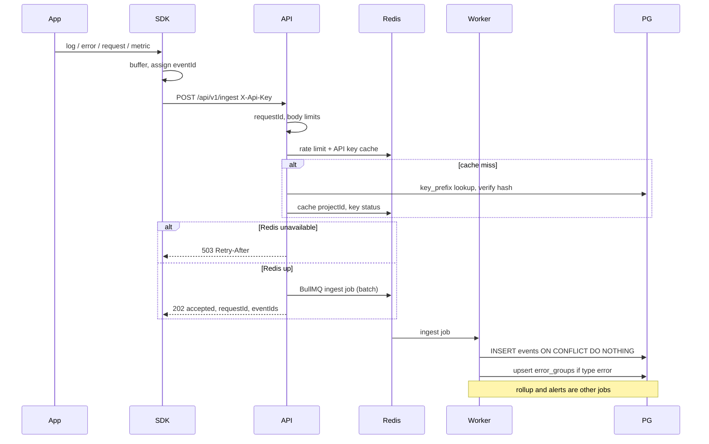
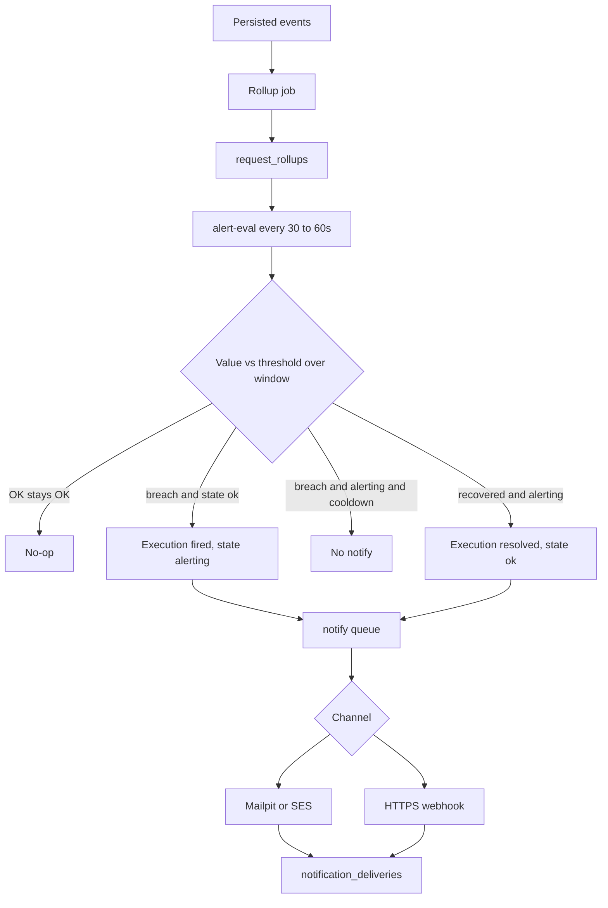

# Data flow

Canonical paths. Table/HTTP field contracts are Batch C. Queue names are in [processing-and-queues.md](./processing-and-queues.md).

## 1. Ingest (write)



**Guarantees:** HTTP success means “accepted for processing,” not “visible in the dashboard.” Duplicates with the same `(projectId, eventId)` become a single row.

## 2. Rollup

```text
ingest persist  →  events.ingested_at
repeatable rollup job (60s)
  → read rollup_watermarks
  → SELECT new events (requests, and errors that feed rates as defined)
  → UPSERT request_rollups (1-minute buckets)
  → advance watermark
```

Ingest jobs **do not** increment rollups. Retries must not double-count.

## 3. Query (read)

```text
Browser  →  Next.js (rewrite /api/v1)  →  API
  → JWT / refresh cookie
  → membership(orgId, userId)
  → project belongs to org
  → events list (cursor) OR request_rollups (summary / series)
  → optional Redis cache TTL 10–15s on summary
```

## 4. Alert and notify



Detail: [alerting-and-notifications.md](./alerting-and-notifications.md).

## 5. Control plane

JWT CRUD for organizations, members, projects, keys, alert rules, and destinations. **No queue** except `POST .../destinations/:id/test` (enqueue one notify job). Key revoke deletes the Redis API-key cache entry immediately.

## Related

- [ingestion.md](./ingestion.md)
- [processing-and-queues.md](./processing-and-queues.md)
- [tenancy-and-auth.md](./tenancy-and-auth.md)
- ADR [003](../decisions/003-queue-first-ingest.md), [005](../decisions/005-scheduled-alert-evaluation.md)
