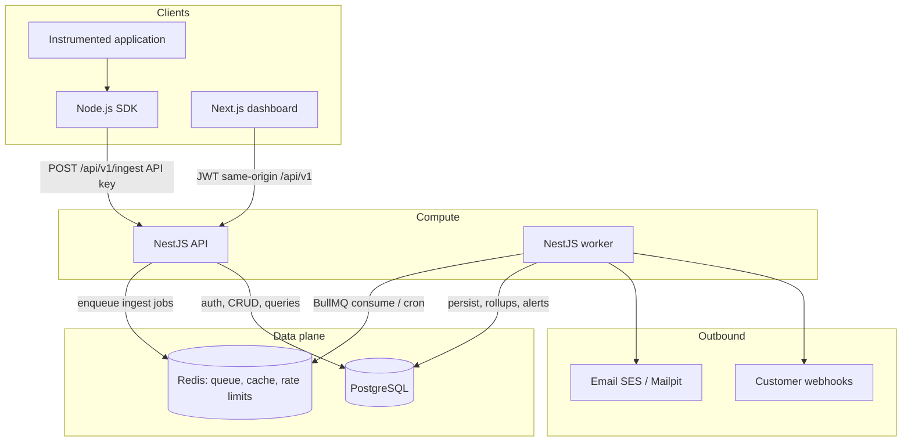

# Architecture overview

PulseWatch is a **modular monolith** with **two deployable processes**:

| Process | App | Responsibility |
|---|---|---|
| **API** | `apps/api` | HTTP: auth, tenancy, ingest (enqueue only), query, alert CRUD |
| **Worker** | `apps/worker` | BullMQ processors + repeatable jobs (persist is *not* on the HTTP path except degraded—we do **not** degrade; see ingest 503) |

Same NestJS/TypeScript codebase family, shared Prisma client, **different entrypoints and containers**. That is the async boundary. There are not ten microservices.

Dashboard (`apps/web`) is a thin Next.js client. The Node SDK (`apps/sdk-node`) is a small ingest client.

## System diagram

## Component map

| Component | Lives in | Does | Does not |
|---|---|---|---|
| Auth | API | Register, login, JWT, refresh, password hash | Ingest auth |
| Organizations / members | API | Tenancy, RBAC | Event storage |
| Projects / API keys | API | Mint/hash/revoke keys; invalidate Redis key cache | Persist telemetry |
| Ingestion | API | Validate, rate-limit, enqueue, 202 | Write events, send alerts |
| Event processing | Worker | Normalize, idempotent insert, error groups | HTTP |
| Rollups | Worker (scheduled) | Minute buckets from persisted events via watermarks | Per-request aggregation in the API |
| Query / dashboard API | API | Lists, summaries, timeseries | Elasticsearch |
| Alert engine | Worker eval + API CRUD | Windowed thresholds, state, cooldown | Ingest path |
| Notifications | Worker | Email/webhook with retry | Sync send in controllers |
| Health / metrics | Both | Live, ready, `/metrics` | Customer APM product |
| SDK | `apps/sdk-node` | Buffer, batch, retry, `eventId` | Business rules |
| Web | `apps/web` | UI over REST | Authorization source of truth |

## Data stores

- **PostgreSQL:** source of truth for users, tenancy, events, rollups, alerts, deliveries.
- **Redis:** BullMQ, ingest rate limits, API-key cache, short dashboard cache. AOF enabled locally.
- **Not in MVP:** Kafka, Elasticsearch, ClickHouse.

Telemetry layout (columns and indexes: [../database/schema.md](../database/schema.md)):

- `events` — logs, errors, HTTP requests
- `metric_samples` — custom metrics
- `request_rollups` — 1-minute request/error/latency aggregates
- `error_groups` — fingerprint grouping

## Two authentication planes

1. **Humans:** email/password, access JWT (`sub` = user id), hashed refresh tokens. Org id is in the URL; membership is checked every request.
2. **Machines:** `X-Api-Key` on ingest only. Keys are hashed at rest; prefix lookup + Redis cache.

## Write path (summary)

SDK/HTTP → API authenticates key (Redis, else DB) → validate batch → **BullMQ `ingest`** → **202**. Worker inserts events (`ON CONFLICT DO NOTHING` on `(project_id, event_id)`). A repeatable **rollup** job advances watermarks. A repeatable **alert-eval** job reads rollups. Notify jobs send email/webhooks.

If Redis is down, ingest returns **503 + Retry-After**. The SDK retries. We do not fall back to a synchronous Postgres write in MVP.

## Read path (summary)

Dashboard → JWT → membership check → lists hit `events` (cursor pagination) → charts hit `request_rollups` (optional Redis TTL 10–15s). UI polls; no WebSockets in MVP.

## Locked decisions

Approved. Rationale: [docs/decisions](../decisions/README.md). Do not silently reverse these.

1. API + worker processes (not processors-only-inside-API, not microservices).
2. Unified `events` + `metric_samples` + `request_rollups`.
3. Single batch `POST /api/v1/ingest`.
4. Scheduled alert evaluation on rollups.
5. Ingest fail-closed when Redis is down (503).
6. Dashboard polling; SSE optional later.
7. Error grouping in MVP.
8. Git: `main` + `feature/*`.
9. AWS production design; cost-capped live demo allowed.
10. Four RBAC roles; workspace created on signup.
11. Avg/count/max always; p95 via histogram or short-window percentile.
12. Mailpit local, SES in AWS; no email-verification gate.

## What this file does not replace

- Data paths: [data-flow.md](./data-flow.md)
- Tenancy/auth: [tenancy-and-auth.md](./tenancy-and-auth.md)
- Ingest: [ingestion.md](./ingestion.md)
- Queues: [processing-and-queues.md](./processing-and-queues.md)
- Alerts: [alerting-and-notifications.md](./alerting-and-notifications.md)
- Query/UI/SDK: [query-dashboard-sdk.md](./query-dashboard-sdk.md)
- Schema: [../database/schema.md](../database/schema.md)
- HTTP: [../api/endpoints.md](../api/endpoints.md)
- Batch D: SDK/dashboard/ops/AWS depth

## Related

- [principles.md](./principles.md)
- [../product/requirements.md](../product/requirements.md)
- [../development/repo-structure.md](../development/repo-structure.md)
