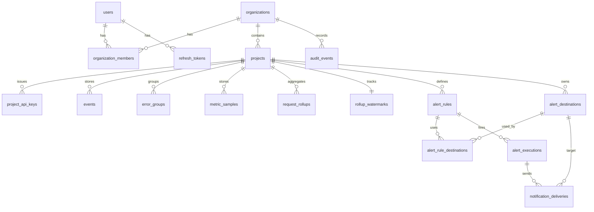

# Database schema

Canonical contract for PostgreSQL + Prisma. Behavior lives in architecture docs; **columns, keys, and indexes live here**. Use Prisma for CRUD; `$queryRaw` for rollups, histogram p95, and short-window `percentile_cont`.

- Timestamps: `timestamptz`, store UTC.
- IDs: UUID (`uuid`).
- Emails: store lowercased; unique.
- JSONB: no GIN in MVP.
- Soft delete: projects/orgs are **hard-deleted** only by owner (cascade telemetry in a job, not a surprise `ON DELETE CASCADE` from org → events in the same request). Prefer `ON DELETE RESTRICT` on telemetry FKs; retention job deletes old events. Org delete: application-level purge then delete org.

Retention: raw `events` + `metric_samples` **14 days**; `request_rollups` **90 days**. `error_groups` kept while the project lives (or until unused — MVP: no auto-delete of groups).

## ER diagram

## Tables

### `users`

Human accounts.

| Column | Type | Notes |
|---|---|---|
| `id` | uuid PK | |
| `email` | text UNIQUE NOT NULL | Lowercased |
| `password_hash` | text NOT NULL | Argon2id |
| `name` | text NOT NULL | |
| `created_at` | timestamptz | |
| `updated_at` | timestamptz | |

**Writes:** register, password change (later). **Reads:** login, `me`, members.

### `organizations`

Tenant.

| Column | Type | Notes |
|---|---|---|
| `id` | uuid PK | |
| `name` | text NOT NULL | |
| `slug` | text UNIQUE NOT NULL | URL-safe, lowercase |
| `created_at` | timestamptz | |
| `updated_at` | timestamptz | |

### `organization_members`

| Column | Type | Notes |
|---|---|---|
| `id` | uuid PK | |
| `organization_id` | uuid FK → organizations | |
| `user_id` | uuid FK → users | |
| `role` | text NOT NULL | `owner` \| `admin` \| `member` \| `viewer` |
| `created_at` | timestamptz | |

UNIQUE (`organization_id`, `user_id`).

### `projects`

| Column | Type | Notes |
|---|---|---|
| `id` | uuid PK | |
| `organization_id` | uuid FK → organizations | |
| `name` | text NOT NULL | |
| `slug` | text NOT NULL | Unique per org |
| `retention_days` | int NOT NULL DEFAULT 14 | Raw event retention |
| `created_at` | timestamptz | |
| `updated_at` | timestamptz | |

UNIQUE (`organization_id`, `slug`).

### `project_api_keys`

| Column | Type | Notes |
|---|---|---|
| `id` | uuid PK | |
| `project_id` | uuid FK → projects | |
| `name` | text NOT NULL | |
| `key_prefix` | text NOT NULL | e.g. `pw_live_ab12cd` |
| `key_hash` | text UNIQUE NOT NULL | SHA-256 or HMAC |
| `last_four` | text NOT NULL | |
| `last_used_at` | timestamptz NULL | Throttled updates |
| `revoked_at` | timestamptz NULL | |
| `created_at` | timestamptz | |

Never store plaintext. Prefix is **not** unique globally (collisions possible); lookup is prefix then hash verify.

### `refresh_tokens`

| Column | Type | Notes |
|---|---|---|
| `id` | uuid PK | |
| `user_id` | uuid FK → users | ON DELETE CASCADE |
| `token_hash` | text UNIQUE NOT NULL | |
| `expires_at` | timestamptz NOT NULL | |
| `revoked_at` | timestamptz NULL | |
| `user_agent` | text NULL | |
| `created_at` | timestamptz | |

### `audit_events`

Key/member/rule mutations only — not ingest volume.

| Column | Type | Notes |
|---|---|---|
| `id` | uuid PK | |
| `organization_id` | uuid FK | |
| `actor_user_id` | uuid FK NULL | |
| `action` | text NOT NULL | e.g. `api_key.created` |
| `target_type` | text NOT NULL | |
| `target_id` | text NOT NULL | |
| `metadata` | jsonb NOT NULL DEFAULT `{}` | |
| `created_at` | timestamptz | |

### `events`

Logs, errors, HTTP requests. **Not** custom metrics.

| Column | Type | Notes |
|---|---|---|
| `id` | uuid PK | Server id |
| `project_id` | uuid FK → projects | Isolation |
| `event_id` | text NOT NULL | Client idempotency |
| `type` | text NOT NULL | `log` \| `error` \| `request` |
| `timestamp` | timestamptz NOT NULL | Event time (clamped) |
| `ingested_at` | timestamptz NOT NULL | Server time; rollup watermark |
| `environment` | text NOT NULL | Default `production` if missing |
| `service` | text NULL | |
| `severity` | text NULL | `debug` \| `info` \| `warning` \| `error` \| `fatal` |
| `message` | text NULL | Truncated 8 KiB |
| `endpoint` | text NULL | Truncated 256 |
| `http_method` | text NULL | |
| `status_code` | int NULL | |
| `duration_ms` | int NULL | |
| `request_id` | text NULL | Customer request id |
| `trace_id` | text NULL | |
| `fingerprint` | text NULL | Errors |
| `release` | text NULL | |
| `payload` | jsonb NOT NULL DEFAULT `{}` | Stack, extras |

UNIQUE (`project_id`, `event_id`).

### `error_groups`

| Column | Type | Notes |
|---|---|---|
| `id` | uuid PK | |
| `project_id` | uuid FK | |
| `fingerprint` | text NOT NULL | |
| `title` | text NOT NULL | Truncated message / type |
| `first_seen_at` | timestamptz NOT NULL | |
| `last_seen_at` | timestamptz NOT NULL | |
| `count` | bigint NOT NULL DEFAULT 0 | Increment on **new** event insert only |
| `status` | text NOT NULL DEFAULT `open` | `open` \| `resolved` |

UNIQUE (`project_id`, `fingerprint`).

### `metric_samples`

| Column | Type | Notes |
|---|---|---|
| `id` | uuid PK | |
| `project_id` | uuid FK | |
| `event_id` | text NOT NULL | Idempotency |
| `timestamp` | timestamptz NOT NULL | |
| `ingested_at` | timestamptz NOT NULL | |
| `name` | text NOT NULL | |
| `type` | text NOT NULL | `gauge` \| `counter` |
| `value` | double precision NOT NULL | |
| `environment` | text NOT NULL | |
| `service` | text NULL | |
| `tags` | jsonb NOT NULL DEFAULT `{}` | |

UNIQUE (`project_id`, `event_id`). Retention 14 days (same sweep as events, or 48h later if we tighten).

### `request_rollups`

1-minute buckets. `error_count` = requests with `status_code >= 500`.

| Column | Type | Notes |
|---|---|---|
| `project_id` | uuid FK | |
| `bucket_at` | timestamptz NOT NULL | `date_trunc('minute', timestamp)` |
| `environment` | text NOT NULL | |
| `endpoint` | text NOT NULL | Real path, or `__all__` for env totals |
| `request_count` | bigint NOT NULL DEFAULT 0 | |
| `error_count` | bigint NOT NULL DEFAULT 0 | |
| `duration_sum` | bigint NOT NULL DEFAULT 0 | |
| `duration_count` | bigint NOT NULL DEFAULT 0 | |
| `duration_max` | int NOT NULL DEFAULT 0 | |
| `duration_histogram` | jsonb NOT NULL | See below |

PRIMARY KEY / UNIQUE (`project_id`, `bucket_at`, `environment`, `endpoint`).

Histogram keys (non-cumulative; one increment per request): `le_50`, `le_100`, `le_250`, `le_500`, `le_1000`, `le_3000`, `inf`. Reconstruct cumulative for p95.

Dashboard all-environments: `SUM` rows with `endpoint = '__all__'`. Top endpoints: `endpoint <> '__all__'`.

### `rollup_watermarks`

| Column | Type | Notes |
|---|---|---|
| `project_id` | uuid PK FK → projects | |
| `last_ingested_at` | timestamptz NOT NULL | Exclusive/inclusive documented in worker: process `ingested_at > last_ingested_at` |
| `updated_at` | timestamptz | |

### `alert_rules`

| Column | Type | Notes |
|---|---|---|
| `id` | uuid PK | |
| `project_id` | uuid FK | |
| `name` | text NOT NULL | |
| `enabled` | boolean NOT NULL DEFAULT true | |
| `kind` | text NOT NULL | See alerting doc |
| `threshold` | double precision NOT NULL | |
| `window_minutes` | int NOT NULL | |
| `filters` | jsonb NOT NULL DEFAULT `{}` | `{ "environment"?, "endpoint"? }` |
| `cooldown_seconds` | int NOT NULL | |
| `notify_on_resolve` | boolean NOT NULL DEFAULT true | |
| `state` | text NOT NULL DEFAULT `ok` | `ok` \| `alerting` |
| `last_evaluated_at` | timestamptz NULL | |
| `last_notified_at` | timestamptz NULL | |
| `last_transition_at` | timestamptz NULL | |
| `created_at` | timestamptz | |
| `updated_at` | timestamptz | |

`kind`: `error_count` \| `error_rate` \| `avg_duration_ms` \| `failed_request_count` \| `endpoint_error_rate`.

### `alert_destinations`

| Column | Type | Notes |
|---|---|---|
| `id` | uuid PK | |
| `project_id` | uuid FK | |
| `type` | text NOT NULL | `email` \| `webhook` |
| `name` | text NOT NULL | |
| `config` | jsonb NOT NULL | email: `{ "address" }`; webhook: `{ "url", "secret" }` |
| `enabled` | boolean NOT NULL DEFAULT true | |
| `created_at` | timestamptz | |
| `updated_at` | timestamptz | |

### `alert_rule_destinations`

| Column | Type | Notes |
|---|---|---|
| `alert_rule_id` | uuid FK | |
| `alert_destination_id` | uuid FK | |

UNIQUE (`alert_rule_id`, `alert_destination_id`). Both destinations must belong to the same project as the rule (enforce in app).

### `alert_executions`

| Column | Type | Notes |
|---|---|---|
| `id` | uuid PK | |
| `alert_rule_id` | uuid FK | |
| `kind` | text NOT NULL | `fired` \| `resolved` |
| `fired_at` | timestamptz NOT NULL | |
| `resolved_at` | timestamptz NULL | Unused for `kind=resolved` rows or set equal to `fired_at` |
| `snapshot` | jsonb NOT NULL | `{ value, windowMinutes, threshold }` |

### `notification_deliveries`

| Column | Type | Notes |
|---|---|---|
| `id` | uuid PK | Also BullMQ job id |
| `alert_execution_id` | uuid FK | |
| `destination_id` | uuid FK | |
| `channel` | text NOT NULL | `email` \| `webhook` |
| `status` | text NOT NULL | `pending` \| `sent` \| `failed` |
| `attempts` | int NOT NULL DEFAULT 0 | |
| `last_status_code` | int NULL | HTTP for webhook |
| `last_error` | text NULL | |
| `next_retry_at` | timestamptz NULL | |
| `sent_at` | timestamptz NULL | |
| `created_at` | timestamptz | |

## Access patterns → indexes

| Pattern | Index |
|---|---|
| Login | `users(email)` UNIQUE |
| Membership by org | `organization_members(organization_id, user_id)` UNIQUE |
| User’s orgs | `organization_members(user_id)` |
| Projects in org | `projects(organization_id)`, UNIQUE `(organization_id, slug)` |
| API key lookup | `project_api_keys(key_prefix)`, UNIQUE `key_hash`, `(project_id) WHERE revoked_at IS NULL` |
| Refresh | UNIQUE `refresh_tokens(token_hash)`, `(user_id, expires_at)` |
| Idempotent ingest | UNIQUE `events(project_id, event_id)` |
| Recent events | `(project_id, timestamp DESC)` |
| Type tabs | `(project_id, type, timestamp DESC)` |
| Environment | `(project_id, environment, timestamp DESC)` |
| Severity | `(project_id, severity, timestamp DESC)` |
| Service | `(project_id, service, timestamp DESC)` |
| Endpoint | `(project_id, endpoint, timestamp DESC) WHERE endpoint IS NOT NULL` |
| Error fingerprint | `(project_id, fingerprint, timestamp DESC) WHERE type = 'error'` |
| Slow requests | `(project_id, duration_ms DESC, timestamp DESC) WHERE type = 'request' AND duration_ms IS NOT NULL` |
| Rollup catch-up | `(project_id, ingested_at)` |
| Error groups | UNIQUE `(project_id, fingerprint)`, `(project_id, last_seen_at DESC)` |
| Metrics | UNIQUE `(project_id, event_id)`, `(project_id, name, timestamp DESC)` |
| Rollups | UNIQUE `(project_id, bucket_at, environment, endpoint)`, `(project_id, bucket_at DESC)` |
| Enabled alerts | `(project_id) WHERE enabled = true` |
| Executions | `(alert_rule_id, fired_at DESC)` |
| Delivery retry | `(status, next_retry_at) WHERE status IN ('pending','failed')` |
| Audit | `(organization_id, created_at DESC)` |

## Watermarks and idempotency

- Event insert: `ON CONFLICT (project_id, event_id) DO NOTHING`. If conflict, do **not** increment `error_groups.count`.
- Rollup: only events with `ingested_at > watermark`. Then set watermark to `max(ingested_at)` of the batch. Never increment rollups from the ingest processor.
- Metric samples: same unique as events.

## Retention job

Daily:

1. `DELETE FROM events WHERE timestamp < now() - project.retention_days` (join projects; default 14).
2. `DELETE FROM metric_samples` with the same rule (or fixed 14 days).
3. `DELETE FROM request_rollups WHERE bucket_at < now() - 90 days`.
4. Do not delete `alert_*` history in MVP (cap later if needed).

## Related

- [../architecture/overview.md](../architecture/overview.md)
- [../architecture/processing-and-queues.md](../architecture/processing-and-queues.md)
- [ADR 004](../decisions/004-unified-events-and-rollups.md)
